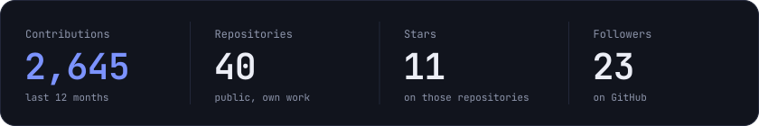
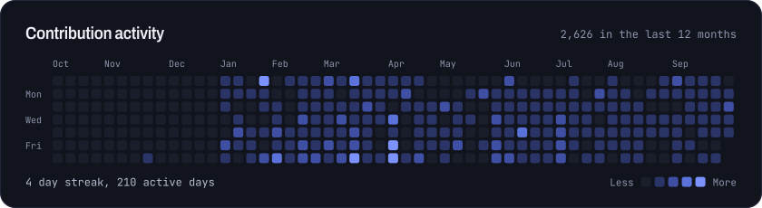
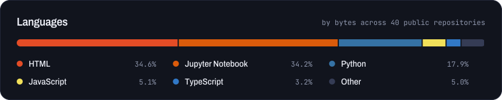

  
  
  
  
  

## About

I'm a Cloud and DevOps engineer. I run CI/CD pipelines, containerized deployments and AWS infrastructure in production, and I build security and observability into the delivery pipeline. I'm doing my MCA at CHRIST University, Bengaluru (2025 to 2027).

On my own time I build infrastructure and security tooling, run a home server, and occasionally torture my RTX 3050 with ML workloads.

**What I'm looking for**

| | |
|---|---|
| Internship | January to May 2027, as part of my MCA course work |
| Then | A full-time role after the internship |
| Location | Remote, Mumbai, Bengaluru, or work from anywhere |
| Focus | Cloud roles with strong hands-on exposure to cloud infrastructure |
| Growing toward | Site Reliability Engineering, Kubernetes cluster management, and AI inference infrastructure (MLOps, model serving) |

## Where I work

**DevOps Developer, [Acumen Travels](https://acumentravels.com/)** · Sep 2025 to present
- Built a gated GitHub Actions pipeline (precheck, migrate, deploy) for a Django and Gunicorn app on AWS EC2. Deploy time went from about 9 minutes to a 2-3 minute median, at around 50 deploys a month.
- Resolved a recurring Supabase PostgreSQL connection failure with a circuit breaker, indexed the high-traffic lookup columns and tuned connection pooling.
- I own Linux server administration, SSL certificates and log monitoring for production.

**System Architect, Research Sync and Backend Developer, Placify AI, CHRIST University IQAC Cell** · Jun 2026 to present
- Architecting Research Sync: a 6+ service Dockerized TypeScript platform behind a GraphQL gateway, with a Prometheus, Grafana and Loki observability stack.
- Own the rate-limited ingestion pipeline (BullMQ and Redis) over the Scopus, Web of Science and ORCID APIs. It syncs 1,000+ records in about 20 minutes.
- Built and containerized the Python backend for Placify AI (FastAPI, Gemini Pro, Kafka, Neo4j), a placement platform serving 11,000+ students across 5 campuses.

**Backend Operator, [Bloom](https://bloomskills.in/)** · Jul 2026 to present
- Backend implementation and migration work across the Tech, Business and Operations teams.

## Projects

<table>
<tr>
<td width="50%" valign="top">

**Research Sync**

A research intelligence platform for CHRIST University leadership. Fetch, processing and AI-enrichment workers sit behind a GraphQL gateway that syncs PostgreSQL with Neo4j. I am the sole architect and developer.

`TypeScript` `GraphQL` `PostgreSQL` `Neo4j` `Redis` `BullMQ` `Docker` `Grafana`

In active development, not public yet.

</td>
<td width="50%" valign="top">

**AI-Driven DevSecOps Vulnerability Pipeline**

Runs Trivy, Bandit, Semgrep and Gitleaks in ephemeral Docker sandboxes. Findings climb a confidence ladder across DeepSeek Coder and Claude models, so the cheaper models take the clear cases first.

`Python` `Docker` `Trivy` `Semgrep` `Gitleaks` `Claude API`

[Code](https://github.com/ArdenDiago/llmbasedcicdpipline) · [Live demo](https://llmbasedcicdpipline.diagoarden.workers.dev)

</td>
</tr>
<tr>
<td width="50%" valign="top">

**Gatekeeper**

An API gateway for microservices: weighted round-robin load balancing, Redis-based adaptive rate limiting, a circuit breaker, W3C Traceparent tracing and a real-time WebSocket dashboard. Runs on AWS EC2 behind Nginx.

`Node.js` `Redis` `MongoDB` `Docker` `AWS EC2` `Nginx`

[Code](https://github.com/zs0c131y/Gatekeeper) · [Live demo](https://gatekeeper-full.fly.dev/)

</td>
<td width="50%" valign="top">

**Runtime X (rtx)**

A process manager and scheduler in Go. Exact exit-code propagation, clean signal forwarding, dependency ordering by topological sort, and restart policies with exponential backoff, behind a REST API and a React dashboard.

`Go` `Linux signals` `REST API` `React`

[Code](https://github.com/ArdenDiago/Runtime-X)

</td>
</tr>
<tr>
<td width="50%" valign="top">

**SonicForge**

A per-application audio router for Linux with per-group DSP (six-band EQ, compressor, gate, limiter). A Rust daemon on PipeWire, run as systemd user services, with CI that tests against a real daemon. Built with Claude Code.

`Rust` `PipeWire` `D-Bus` `systemd` `GitHub Actions`

Private repository.

</td>
<td width="50%" valign="top">

**Kairos 25**

The fest management platform for the Kairos 2025 technical fest. Deployed on AWS (S3, CloudFront, EC2 auto-scaling) through GitHub Actions, with Google sign-in and Razorpay payments for event registration.

`TypeScript` `AWS` `Docker` `GitHub Actions` `MongoDB`

[Code](https://github.com/ArdenDiago/Kairos_25-_Final-Year-Project)

</td>
</tr>
</table>

Also: [CodePulse](https://github.com/zs0c131y/CodePulse), an engineering intelligence prototype that reports on repository health and documentation drift ([live demo](https://codepulse.ardend.dev)).

## Stack

  
   
  

| Area | Tools |
|---|---|
| Cloud | AWS (EC2, S3, IAM, VPC, CloudFront, CloudWatch), Oracle Cloud (OCI certified), Google Cloud |
| DevOps and CI/CD | GitHub Actions, Docker, Docker Compose, Kubernetes, Nginx, Linux, Bash, Terraform and CloudFormation *(learning)* |
| DevSecOps | Trivy, Bandit, Semgrep, Gitleaks, Snyk, SonarQube, OWASP ZAP |
| Observability | Prometheus, Grafana, Loki, ELK Stack |
| Data and queues | PostgreSQL, MongoDB, Redis, BullMQ, Kafka, Neo4j, Supabase, MySQL |
| Languages and frameworks | Python, TypeScript, Go, Rust, Node.js, Express, Fastify, FastAPI, Django, GraphQL, React |
| AI and LLM integration | Claude API, Google Gemini, DeepSeek Coder, multi-model orchestration |

## Linux

Linux has been my daily system since 2022: Red Hat, then Fedora, then Pop!_OS, and now Arch Linux with the niri Wayland compositor and Quickshell ([my config](https://github.com/ArdenDiago/ArchLinuxConfig)). At Acumen Travels that daily use is the job: I own server administration, SSL certificates and log monitoring in production.

At home I run an Ubuntu Server machine behind a firewall and DNS protection. It runs my code when I travel and builds my projects when I am away from my main machine.

## Writing

I write about Docker, Linux and DevOps on my blog: **[ardend.dev/blog](https://ardend.dev/blog)**

Write to me at [talk@ardend.dev](mailto:talk@ardend.dev).
